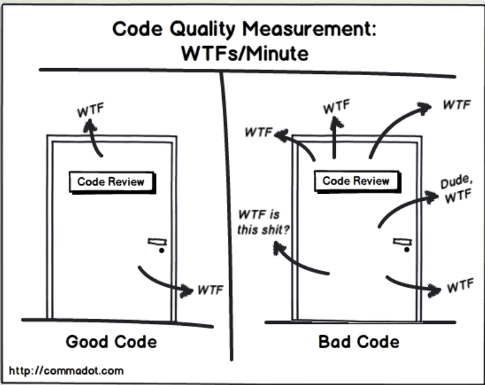
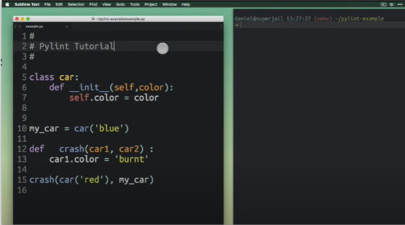

# Linting

How can one measure "code quality"?

Well... close!

Fortunately for use, there are tools that can help us locate code smells (remember those) and measure code quality. These tools are called linters. Though there are many linters out there, we will focus on `pylint`.

## Pylint Tutorial

  

[Link to video](https://youtu.be/fFY5103p5-c)

After this lesson you should:

- Know how to install and set up the Pylint code linter,
- Know the pros and cons of `pylint`.

## Pylint Configuration

[Link to Pylint user guide](https://pylint.pycqa.org/en/latest/user_guide/configuration/index.html)

This is a reference document from the Pylint documentation explaining how users can generate configuration files. It will be necessary for the assignment.

After this lesson you should:

- Know how to create a configuration file you can then use to customize `pylint`'s behavior.
